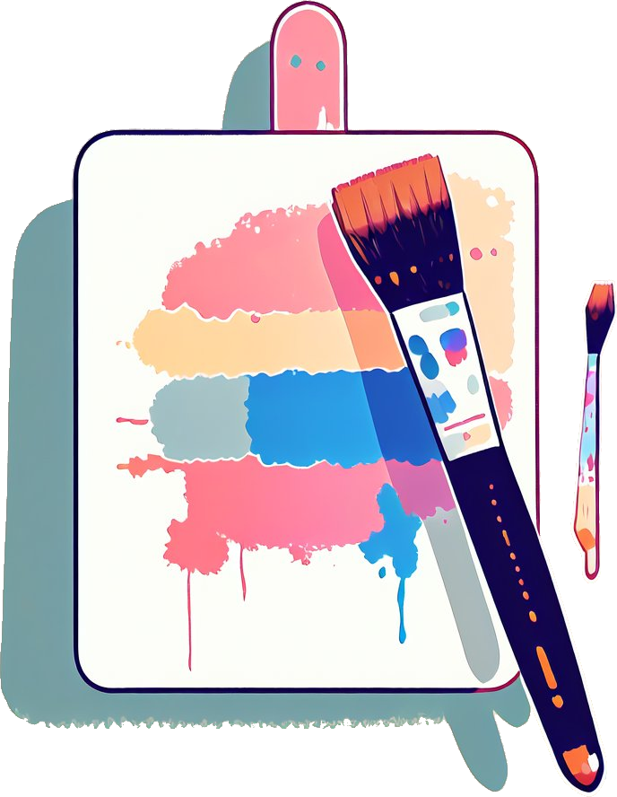

<p align="center">
  
</p>

<h1 align="center">
  Brush
</h1>

<p align="center">
  Use Griseo's brush to paint beautifully formatted strings!
<p>


## Install

```sh
npm install @griseo.js/brush
```

## Usage

Brush comes with a flexible API where you can use the syntax of your favorite string formatting library!

### Chalk Syntax

```js
import { brush } from '@griseo.js/brush'

const log = console.log

// Combine styled and normal strings
log(brush.blue('Hello') + ' World' + brush.red('!'))

// Compose multiple styles using the chainable API
log(brush.blue.bgRed.bold('Hello world!'))

// Pass in multiple arguments
log(brush.blue('Hello', 'World!', 'Foo', 'bar', 'biz', 'baz'))

// Nest styles
log(brush.red('Hello', brush.underline.bgBlue('world') + '!'))

// Nest styles of the same type even (color, underline, background)
log(
  brush.green(
    'I am a green line ' +
      brush.blue.underline.bold('with a blue substring') +
      ' that becomes green again!',
  ),
)

// ES2015 template literal
log(`
CPU: ${brush.red('90%')}
RAM: ${brush.green('40%')}
DISK: ${brush.yellow('70%')}
`)

// Use RGB colors in terminal emulators that support it.
log(brush.rgb(123, 45, 67).underline('Underlined reddish color'))
log(brush.hex('#DEADED').bold('Bold gray!'))
```

Easily define your own themes:

```js
import { brush } from '@griseo.js/brush'

const error = brush.bold.red
const warning = brush.hex('#FFA500') // Orange color

console.log(error('Error!'))
console.log(warning('Warning!'))
```

Take advantage of console.log [string substitution](https://nodejs.org/docs/latest/api/console.html#console_console_log_data_args):

```js
import { brush } from '@griseo.js/brush'

const name = 'Sindre'
console.log(brush.green('Hello %s'), name)
//=> 'Hello Sindre'
```

### Kleur Syntax

#### Chained Methods

```js
import { brush } from '@griseo.js/brush'
const { bold, green } = brush

console.log(bold().red('this is a bold red message'))
console.log(bold().italic('this is a bold italicized message'))
console.log(bold().yellow().bgRed().italic('this is a bold yellow italicized message'))
console.log(green().bold().underline('this is a bold green underlined message'))
```

#### Nested Methods

```js
import { brush } from '@griseo.js/brush'
const { yellow, red, cyan } = brush

console.log(yellow(`foo ${red().bold('red')} bar ${cyan('cyan')} baz`))
console.log(yellow('foo ' + red().bold('red') + ' bar ' + cyan('cyan') + ' baz'))
```

### Picolors Syntax

```js
import { brush } from '@griseo.js/brush'

console.log(brush.green(`How are ${brush.italic(`you`)} doing?`))
```

## Chaining API (Chalk Syntax)

### brush.`<style>[.<style>...](string, [string...])`

Example: `brush.red.bold.underline('Hello', 'world');`

Chain [styles](#styles) and call the last one as a method with a string argument.
Order doesn't matter, and later styles take precedent in case of a conflict.
This simply means that `brush.red.yellow.green` is equivalent to `brush.green`.

Multiple arguments will be separated by space.

### brush.level

Specifies the level of color support.

Color support is automatically detected, but you can override it by setting the `level` property.
You should however only do this in your own code as it applies globally to all Brush consumers.

If you need to change this in a reusable module, create a new instance:

```js
import { createBrush } from '@griseo.js/brush'

const customBrush = createBrush({ level: 0 })
```

| Level | Description                           |
| :---: | :------------------------------------ |
|  `0`  | All colors disabled                   |
|  `1`  | Basic color support (16 colors)       |
|  `2`  | 256 color support                     |
|  `3`  | Truecolor support (16 million colors) |

### supportsColor

Detect whether the terminal [supports color](https://github.com/Elysium-Everlasting/griseo.js/tree/main/packages/palette).
Used internally and handled for you, but exposed for convenience.

Can be overridden by the user with the flags `--color` and `--no-color`.
For situations where using `--color` is not possible,
use the environment variable `FORCE_COLOR=1` (level 1), `FORCE_COLOR=2` (level 2), or `FORCE_COLOR=3` (level 3) to forcefully enable color,
or `FORCE_COLOR=0` to forcefully disable.
The use of `FORCE_COLOR` overrides all other color support checks.

Explicit 256/Truecolor mode can be enabled using the `--color=256` and `--color=16m` flags, respectively.

### brushStderr and supportsColorStderr

`brushStderr` contains a separate instance configured with color support detected for `stderr` stream instead of `stdout`.
Override rules from `supportsColor` apply to this too. `supportsColorStderr` is exposed for convenience.

### modifierNames, foregroundColorNames, backgroundColorNames, and colorNames

All supported style strings are exposed as an array of strings for convenience.
`colorNames` is the combination of `foregroundColorNames` and `backgroundColorNames`.

This can be useful if you wrap Brush and need to validate input:

```js
import { modifierNames, foregroundColorNames } from '@griseo.js/brush'

console.log(modifierNames.includes('bold'))
//=> true

console.log(foregroundColorNames.includes('pink'))
//=> false
```

## Styles

### Modifiers

- `reset` - Reset the current style.
- `bold` - Make the text bold.
- `dim` - Make the text have lower opacity.
- `italic` - Make the text italic. _(Not widely supported)_
- `underline` - Put a horizontal line below the text. _(Not widely supported)_
- `overline` - Put a horizontal line above the text. _(Not widely supported)_
- `inverse`- Invert background and foreground colors.
- `hidden` - Print the text but make it invisible.
- `strikethrough` - Puts a horizontal line through the center of the text. _(Not widely supported)_
- `visible`- Print the text only when Brush has a color level above zero. Can be useful for things that are purely cosmetic.

### Colors

- `black`
- `red`
- `green`
- `yellow`
- `blue`
- `magenta`
- `cyan`
- `white`
- `blackBright` (alias: `gray`, `grey`)
- `redBright`
- `greenBright`
- `yellowBright`
- `blueBright`
- `magentaBright`
- `cyanBright`
- `whiteBright`

### Background colors

- `bgBlack`
- `bgRed`
- `bgGreen`
- `bgYellow`
- `bgBlue`
- `bgMagenta`
- `bgCyan`
- `bgWhite`
- `bgBlackBright` (alias: `bgGray`, `bgGrey`)
- `bgRedBright`
- `bgGreenBright`
- `bgYellowBright`
- `bgBlueBright`
- `bgMagentaBright`
- `bgCyanBright`
- `bgWhiteBright`

## 256 and Truecolor color support

Brush supports 256 colors and [Truecolor](https://github.com/termstandard/colors) (16 million colors) on supported terminal apps.

Colors are downsampled from 16 million RGB values to an ANSI color format that is supported by the terminal emulator
(or by specifying `{level: n}` as a Brush option).
For example, Brush configured to run at level 1 (basic color support)
will downsample an RGB value of #FF0000 (red) to 31 (ANSI escape for red).

Examples:

- `brush.hex('#DEADED').underline('Hello, world!')`
- `brush.rgb(15, 100, 204).inverse('Hello!')`

Background versions of these models are prefixed with `bg` and the first level of the module capitalized (e.g. `hex` for foreground colors and `bgHex` for background colors).

- `brush.bgHex('#DEADED').underline('Hello, world!')`
- `brush.bgRgb(15, 100, 204).inverse('Hello!')`

The following color models can be used:

- [`rgb`](https://en.wikipedia.org/wiki/RGB_color_model) - Example: `brush.rgb(255, 136, 0).bold('Orange!')`
- [`hex`](https://en.wikipedia.org/wiki/Web_colors#Hex_triplet) - Example: `brush.hex('#FF8800').bold('Orange!')`
- [`ansi256`](https://en.wikipedia.org/wiki/ANSI_escape_code#8-bit) - Example: `brush.bgAnsi256(194)('Honeydew, more or less')`

## Browser support

Since Chrome 69, ANSI escape codes are natively supported in the developer console.
